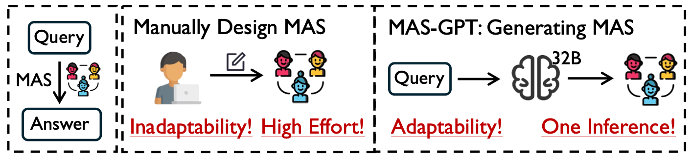

# [ICML2025] MAS-GPT: Training LLMs to Build LLM-based Multi-Agent Systems

This is the official repository for the paper: MAS-GPT: Training LLMs to Build LLM-based Multi-Agent Systems.

MAS-GPT is an open-source model trained to take a user query and generate a complete, executable, and query-adaptive MAS in a single inference. This generated system can then be immediately used to process the query and deliver a high-quality solution.



## Key Features
- 🤖 Query-Adaptive MAS Generation: Automatically designs and generates a unique Multi-Agent System tailored to any given user query.

- ⚡ Single-Inference Efficiency: Builds a complete and executable MAS in just one forward pass.

- 💻 Executable Code as Output: Represents the entire MAS as a ready-to-run Python code snippet.

## Get Started

1. Set up the prerequisites:
```
git clone https://github.com/MASWorks/MAS-GPT.git
cd MAS-GPT
conda create --name masgpt python=3.12
conda activate masgpt
pip install -r requirements.txt
# Download the model weights from the Hugging Face Hub https://huggingface.co/MASWorks/MAS-GPT-32B
```

2. Put your test datasets into `./test/data_pool/{your_dataset_name}.json`.
```
{
    "query": "...",
    "gt": "...",
    "tag": ["..."],     # optional
    "source": "..."    # optional
}
```

3. Use MAS-GPT to generate the MAS:
```
# Option 1: Use the local LLM
CUDA_VISIBLE_DEVICES=0,1 python masgpt_mas_gen.py \
--masgpt_name MAS-GPT-32B \
--masgpt_model_path {your downloaded model path} \
--test_dataset_names MATH GSM-Hard \
--gpu_num 2

# Option 2: Use the served LLM (e.g., deploy the model using vLLM, SGLang)
python masgpt_mas_gen.py \
--masgpt_name MAS-GPT-32B \
--masgpt_serving_url {your served LLM url} \
--max_workers {set according to your GPU memory} \
--test_dataset_names MATH GSM-Hard
```

The generated MAS will be saved in `./test/{dataset_name}/masgpt_{masgpt_name}_gen.json`

4. Inference of the MAS generated by MAS-GPT:

First, put the model (used to drive the agent, e.g., llama-3-70b-instruct) info into `./model_configs/model_config.json`:
```
{
    "model_dict": {
        "llama-3-70b-instruct": [
            ["llama-3-70b-instruct", "http://aa.bb.cc.dd:port/v1", "EMPTY"]
        ]
    },
    "worker_dict": {
        "llama-3-70b-instruct": 40
    }
}
```

Second, inference the MAS generated by MAS-GPT where you can determine the model (used to drive the agent, e.g., llama-3-70b-instruct) to use:

```
python masgpt_mas_infer.py \
--mas_model_name {model_name that drives the agent, e.g., llama-3-70b-instruct} \
--masgpt_name MAS-GPT-32B \
--test_dataset_names MATH GSM-Hard
```

5. Evaluate the performance
To be updated..

## Citation
```
@article{ye2025mas,
  title={MAS-GPT: Training LLMs to build LLM-based multi-agent systems},
  author={Ye, Rui and Tang, Shuo and Ge, Rui and Du, Yaxin and Yin, Zhenfei and Chen, Siheng and Shao, Jing},
  journal={arXiv preprint arXiv:2503.03686},
  year={2025}
}
```